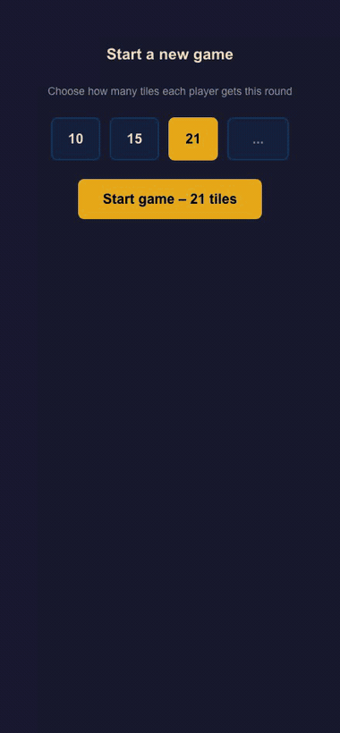
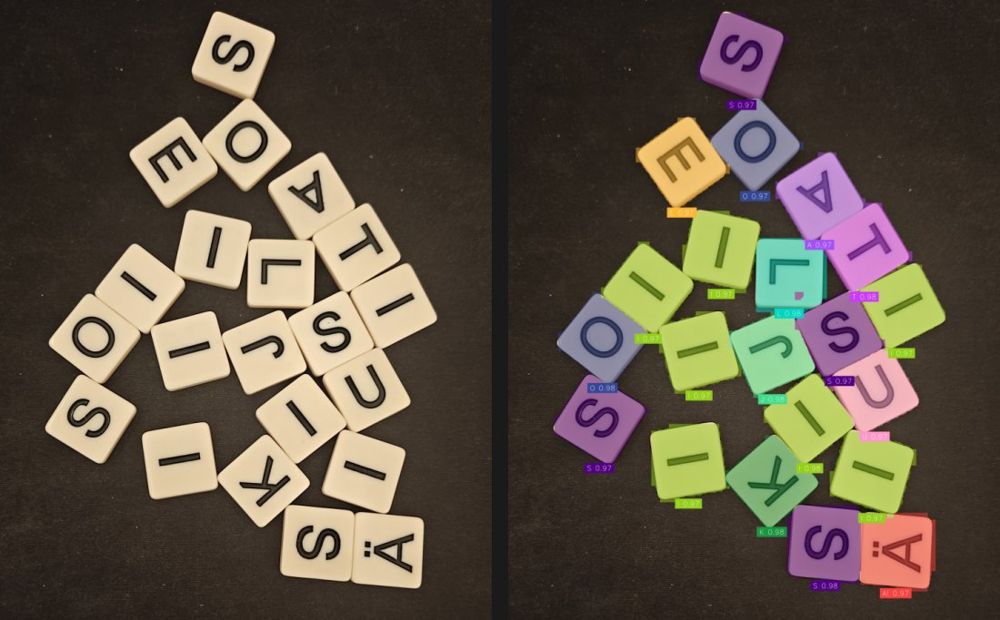
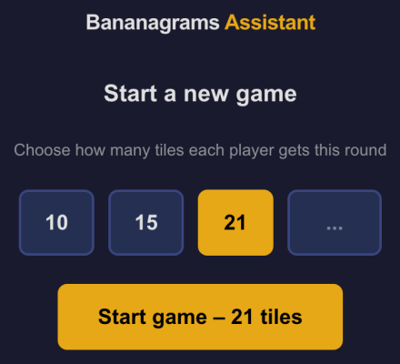
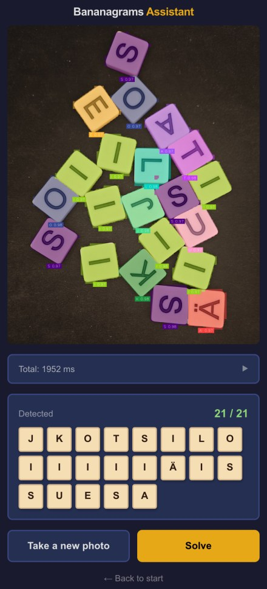
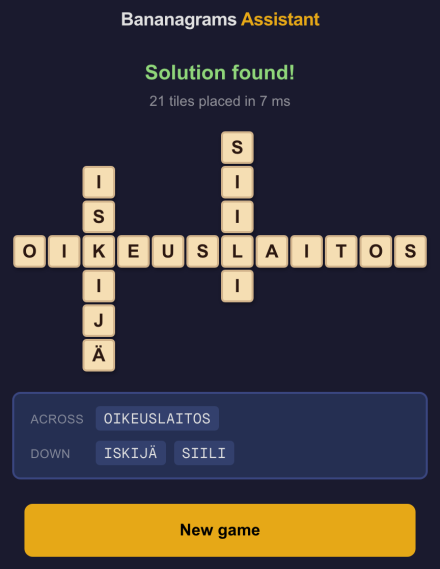
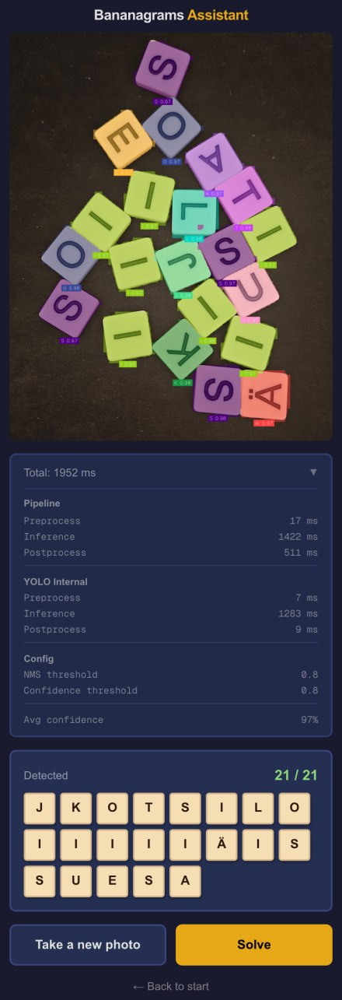

# Bananagrams Assistant

**Point a camera at a pile of scattered Bananagrams tiles and get back a complete, valid crossword grid, in under two seconds.**

A full-stack computer vision + search project: a YOLO11x segmentation model reads the letters off physical tiles, and a from-scratch C++ backtracking solver arranges every one of them into a connected crossword of valid Finnish words.

<p align="center">
  
</p>

<p align="center">
  <em>Real run, nothing staged: 21 tiles detected at 97% mean confidence in 1.4 s, then packed into a full grid in 7 ms.</em>
</p>

---

## How it works

Three independent services, each doing one job:

| | |
|---|---|
| **1. See** | A YOLO11x-seg model (fine-tuned on 70 hand-labelled photos) finds every tile in the frame and classifies its letter, including the Finnish `ä` and `ö`. |
| **2. Check** | Detected tile count is compared against the expected hand size. Mismatches are surfaced for manual correction rather than silently guessed at. |
| **3. Solve** | A C++17 backtracking solver packs all the letters into a single connected crossword in which every horizontal and vertical run is a real dictionary word. |

### Step 1: Seeing the tiles

Raw photo in, per-tile instance masks and letter classes out. Tiles overlap, sit at arbitrary rotations, and are photographed under uncontrolled lighting:

<p align="center">
  
</p>

Note the model reading tiles that are rotated to arbitrary angles, upside-down, and butted directly against each other, and correctly separating `A` from `Ä` (bottom right).

### Step 2: Solving the grid

The 21 detected letters `J K O T S I L O I I I I I Ä I S S U E S A` become:

```
            S
    I       I
    S       I
O I K E U S L A I T O S
    I       I
    J
    Ä
```

`OIKEUSLAITOS` × `ISKIJÄ` × `SIILI`: 21 tiles, zero left over, every horizontal and vertical run a valid Finnish word. Found in **7 ms**.

---

## The app

<table>
<tr>
<td width="33%"></td>
<td width="33%"></td>
<td width="33%"></td>
</tr>
<tr>
<td align="center"><b>Pick your hand size</b></td>
<td align="center"><b>Confirm the read</b></td>
<td align="center"><b>Get the grid</b></td>
</tr>
</table>

Tiles in the solution grid size themselves to the board, so a 17-column
answer still fits a phone screen without scrolling sideways, and the words
it placed are listed underneath.

Every run exposes its own timing breakdown, so the pipeline is measurable rather than a black box:

<p align="center">
  
</p>

---

## Results

### Detection accuracy

The dataset is 100 hand-labelled photos split 70 / 20 / 10. The model was fine-tuned from `yolo11x-seg.pt` for 200 epochs on the 70-image train split, with the 20-image valid split used for validation during training. Measured with `ultralytics val` at `imgsz=640`:

| Split | Images | Instances | Precision | Recall | Box mAP@50 | Box mAP@50-95 | Mask mAP@50-95 |
|---|---|---|---|---|---|---|---|
| **test** (never seen during training) | 10 | 243 | 0.991 | 1.000 | 0.995 | 0.990 | 0.921 |
| valid (used for validation) | 20 | 471 | 0.995 | 0.997 | 0.995 | 0.993 | 0.936 |

The **test** row is the honest number: 243 tile instances the model had no contact with during training, and it found every one of them, at recall 1.000 and 0.991 mean precision across the 22 classes. The valid row is listed for completeness but is not an unbiased estimate, since training used it for validation.

Caveat worth stating plainly: 10 images is a small test set, and all of it comes from the same tile set and shooting conditions. These numbers say the model has comfortably learned *these* tiles, not that it would generalise to a different Bananagrams set on a different table.

In live use the server additionally discards anything under a 0.8 confidence threshold, which is why real runs report ~96-97% mean confidence.

### Solver success rate

Measured in-process, with no HTTP in the loop, over 200 randomly generated hands per size, letters drawn independently in proportion to their frequency in the Finnish wordlist. **Every grid the solver returns is machine-checked**: it must use exactly the dealt tiles, form a single connected component, and every horizontal and vertical run of 2+ letters must be in the dictionary.

| Hand | Solved | Median | p95 | Slowest |
|---|---|---|---|---|
| 10 tiles | **176/200 (88.0%)** | <1 ms | <1 ms | 11 ms |
| 15 tiles | **193/200 (96.5%)** | <1 ms | 7 ms | 1.2 s |
| 21 tiles | **197/200 (98.5%)** | <1 ms | 31 ms | 1.3 s |

All 600 grids passed validation: no invalid words, no stray tiles, no disconnected boards.

The hands it doesn't solve hit the search budget rather than proving anything, and they are extreme draws: the three misses at 21 tiles had only 4 or 5 vowels between them. A real tile bag produces those far less often than independent sampling does.

### Latency

End-to-end on an **Apple M3, CPU-only inference** (no GPU, no CoreML/TensorRT acceleration):

| Stage | Time |
|---|---|
| Preprocess (image decode) | 12 ms |
| YOLO inference | 930 ms |
| Postprocess (NMS, annotation, encoding) | 452 ms |
| **Detection total** | **1 394 ms** |
| Solver (21 tiles) | 7 ms |
| **Photo → finished grid** | **~1.4 s** |

Detection is the median of 8 consecutive warm requests, which ranged 1 349 to 1 540 ms. Two things move it: the first request after startup is slower while the model warms up, and inference slows down when it is sharing the CPU. The stats panel in the screenshot above reads higher than this table for exactly that reason, since a browser and a dev server were running alongside it while the shot was taken.

The solver is now a rounding error. Reading the physical world is the entire cost.

---

## The scale of the problem

To understand why the solver has to prune rather than enumerate, consider how many grids exist, even ignoring the dictionary entirely.

**Step 1: Board shapes (fixed polyominoes).** Any connected layout of 21 squares on a grid is a fixed polyomino. Per [OEIS A001168](https://oeis.org/A001168) there are exactly **22,964,779,660** of them for 21 squares. "Fixed" because rotating a layout 90° creates a new reading path, so orientation matters.

**Step 2: Letter arrangements.** Arranging 21 distinct letters into any one of those shapes gives 21! possibilities:

$$21! = 51{,}090{,}942{,}171{,}709{,}440{,}000$$

**Step 3: Multiply.**

$$22{,}964{,}779{,}660 \times 51{,}090{,}942{,}171{,}709{,}440{,}000 = 1{,}173{,}292{,}229{,}595{,}109{,}175{,}141{,}990{,}400{,}000$$

Roughly **1.17 nonillion** layouts. The space where every run is also a valid dictionary word is a vanishing sliver of that, which is the whole argument for depth-first search with early pruning instead of generate-and-test.

### How the solver actually works

1. The 90,474-word list is indexed once at startup into per-word letter-count vectors plus a 32-bit letter-presence mask, sorted longest-first. "Which words could these tiles spell?" becomes a mask test and a 32-byte comparison instead of a dictionary scan.
2. Place a seed word in the middle of the board, trying the longest the hand can spell first.
3. Recursively extend. For each letter already on the board, find words that spend the remaining hand tiles plus that one board letter, and try every position in the word against every matching cell, in both directions.
4. A placement is legal only if the cells before and after it are empty (so the run it forms is exactly that word) and **every perpendicular run it creates is itself a dictionary word**. Tiles are then deducted based on the cells actually written, so a word crossing two existing letters is accounted for correctly.
5. Succeed when the hand is empty. On a dead end, undo the grid writes, the spent tiles and the used-word marker, and try the next candidate.

Step 4 is what lets the board get dense: a placement is judged by the words it creates, not by whether it happens to touch something. Step 5 is what makes the recursion real: every branch is fully reversible, so the search can commit to a candidate and still get back if it leads nowhere.

The search is bounded by a node and wall-clock budget (300,000 nodes / 5 s by default, both tunable on `Board`). A `solved: false` therefore means "no packing found within budget", which is not the same as proving the hand impossible.

---

## Architecture

```
┌─────────────────────────────────────────────────────┐
│                 Frontend (Next.js)                  │
│                Port 3000 (Turbopack)                │
│   ┌──────────────┐              ┌──────────────┐    │
│   │ Setup        │──────────────│ Capture      │    │
│   │ (tile count) │              │ (camera/img) │    │
│   └──────────────┘              └──────────────┘    │
│          ▲                               ▲          │
│          │                               │          │
│          └───────────────┬───────────────┘          │
│                          │                          │
└──────────────────────────┼──────────────────────────┘
                           │
         ┌─────────────────┼─────────────────┐
         │                 │                 │
         ▼                 ▼                 ▼
     ┌────────┐      ┌───────────┐      ┌─────────┐
     │ Solver │      │ Segmenter │      │ Display │
     │ :8080  │      │ :8081     │      │ Results │
     └────────┘      └───────────┘      └─────────┘
         │                 │                 │
         └─────────────────┬─────────────────┘
                           │
         ┌─────────────────┼─────────────────┐
         │                 │                 │
         ▼                 ▼                 ▼
    ┌──────────┐     ┌───────────┐     ┌───────────┐
    │ C++ HTTP │     │ YOLO ONNX │     │ Wordlist  │
    │ Server   │     │ Model     │     │ (Finnish) │
    └──────────┘     └───────────┘     └───────────┘
```

| Service | Stack | Notes |
|---|---|---|
| Frontend | Next.js 16, React 19, TypeScript, Tailwind 4 | Camera capture, file upload, manual letter entry, grid rendering |
| Solver | C++17 | Backtracking search plus an HTTP server written directly on POSIX sockets, with no framework, no JSON library and no dependencies |
| Segmentation | Python, Flask, ONNX Runtime | YOLO11x-seg via Ultralytics, `supervision` for NMS and annotation |

The C++ service implements its own HTTP parsing and JSON serialisation against raw sockets. That was the point of the exercise: it builds and runs with nothing but a compiler.

---

## Project structure

```
bananagrams-assistant/
├── backend/
│   ├── solver/                     # C++ solving engine
│   │   ├── main.cpp                # HTTP server (port 8080)
│   │   ├── solver.h                # Board model & backtracking solver
│   │   └── utils.h                 # Timers, wide-char conversions
│   ├── segmentation/               # Python tile detection
│   │   ├── segmentation-server.py  # Flask server (port 8081)
│   │   └── requirements.txt
│   └── wordlist-parser/            # Finnish word list processing
│       ├── wordlist-parser.py
│       ├── wordlist.txt            # 90,474 filtered playable words
│       └── nykysuomensanalista2024.txt
├── frontend/                       # Next.js web UI
│   └── app/
│       ├── page.tsx                # Main game interface
│       ├── layout.tsx
│       └── globals.css
├── image-segmentation/             # YOLO training & export
│   ├── dataset/                    # 100 labelled images (70/20/10), 22 classes
│   ├── detect.py
│   ├── export-onnx.py
│   └── models/
│       └── yolo11x-seg-200epochs-100images.onnx
└── docs/                           # README media
```

---

## Getting started

### Prerequisites

- ONNX model at `image-segmentation/models/yolo11x-seg-200epochs-100images.onnx`
- Finnish wordlist at `backend/wordlist-parser/wordlist.txt`
- g++ with C++17 and POSIX sockets (macOS/Linux), Python 3.8+, Node.js 18+

### Docker Compose (recommended)

```bash
make up      # build and start all three services
make down    # stop them
make logs    # follow the logs
```

`make help` lists the rest. These are thin wrappers over `docker compose`, so
`docker compose up --build -d` works just as well.

That brings up all three services: the frontend on `:3000`, the solver on
`:8080` and the detection server on `:8081`.

The compose file mounts the ONNX model from `image-segmentation/models/`. Alternatively set `MODEL_DOWNLOAD_URL` to fetch it on first run.

### Manual

```bash
# Terminal 1: C++ solver
cd backend/solver
g++ -std=c++17 -O2 -pthread main.cpp -o solver-server
./solver-server ../wordlist-parser/wordlist.txt

# Terminal 2: segmentation server
cd backend/segmentation
python3 -m venv .venv && source .venv/bin/activate
pip install -r requirements.txt
python3 segmentation-server.py

# Terminal 3: frontend
cd frontend
yarn install && yarn dev
```

Then open `http://localhost:3000`, or `http://<your-machine-ip>:3000` from a
phone on the same network, which is the point of the thing. The frontend
derives the backend URLs from whatever hostname you load it on, so that works
with no extra configuration. See [RUNNING.md](RUNNING.md) for more detail.

---

## API

### Solver (port 8080)

`GET /health` → `{"status": "ok"}`

`POST /solve`

```jsonc
// request
{ "letters": "jkotsiloiiiiiäissuesa" }

// response
{
  "solved": true,
  "time_ms": 7,
  "grid": [
    [null, null, null, null, null, null, "S",  null, null, null, null, null],
    [null, null, "I",  null, null, null, "I",  null, null, null, null, null],
    [null, null, "S",  null, null, null, "I",  null, null, null, null, null],
    ["O",  "I",  "K",  "E",  "U",  "S",  "L",  "A",  "I",  "T",  "O",  "S"],
    [null, null, "I",  null, null, null, "I",  null, null, null, null, null],
    [null, null, "J",  null, null, null, null, null, null, null, null, null],
    [null, null, "Ä",  null, null, null, null, null, null, null, null, null]
  ]
}
```

`solved: false` comes back with an empty grid when no packing is found within the search budget.

The request body may use raw UTF-8 or `\uXXXX` escapes for `ä` and `ö`. Both decode correctly, so clients like Python's `json.dumps` (which escapes non-ASCII by default) work as well as the browser's `JSON.stringify`.

### Segmentation (port 8081)

`GET /health` → `{"status": "ok"}`

`POST /detect` with `multipart/form-data` and an `image` field

```jsonc
{
  "letters": "jkotsiloiiiiiäissuesa",
  "letter_list": [{ "letter": "j", "confidence": 0.985 }, ...],
  "annotated_image": "<base64 jpeg>",
  "count": 21,
  "timing":      { "preprocess_ms": 12, "inference_ms": 930, "postprocess_ms": 452, "total_ms": 1394 },
  "yolo_timing": { "preprocess_ms": 2,  "inference_ms": 882, "postprocess_ms": 7 },
  "avg_confidence": 97,
  "thresholds": { "nms": 0.8, "confidence": 0.8 }
}
```

---

## Configuration

| Where | Setting | Purpose |
|---|---|---|
| `backend/segmentation/segmentation-server.py` | `NMS_THRESHOLD = 0.8` | Suppress overlapping detections |
| | `CONFIDENCE_THRESHOLD = 0.8` | Minimum detection score |
| | `MODEL_PATH` | ONNX model location |
| `frontend/app/page.tsx` | `TILE_PRESETS` | Default hand-size options |
| | `VALID_CHARS` | The 22 letters on the Finnish tile set |
| | `NEXT_PUBLIC_*_SERVER_URL` | Backend endpoints (see `.env.example`) |

---

## Notes

- The tile set is Finnish, so the alphabet is 22 letters: `c`, `f`, `q`, `w`, `x`, `z` and `å` never appear on a tile.
- Camera capture requires HTTPS or `localhost`; the upload path works anywhere.
- Both backends report timing breakdowns on every request, which is how the numbers above were measured.
